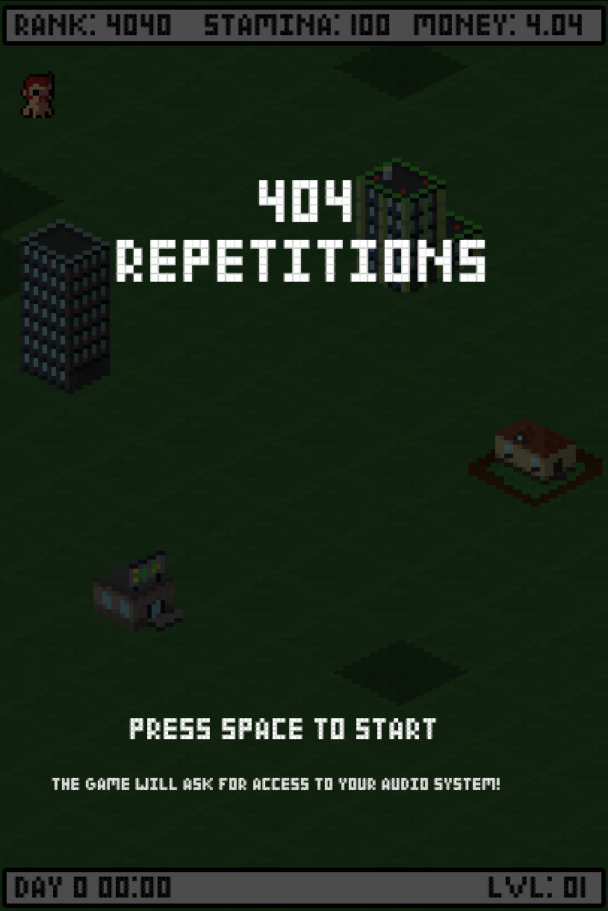

# 404 Repetitions

`404 Repetitions` is a sports simulator in which you feel the very urge to become the 404th best sportsman in the world.
It comes with a prototypical stats system, a mini game engine and tiny town in which you can pursuit your dream.

## Controls

The game is played exclusively with the keyboard. Use arrow keys or WASD and the SPACE bar to move the character around and to interact with the environment.

curl -X POST \
  --form bundle=@dist/build.zip \
  --form category=desktop \
  https://iw8sii1h9b.execute-api.eu-west-1.amazonaws.com/stage/analyze-bundle